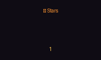
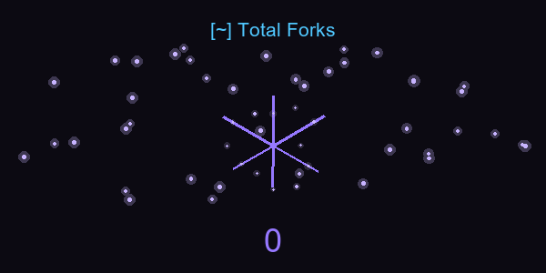
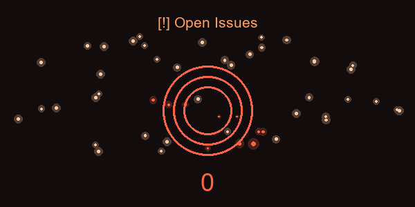
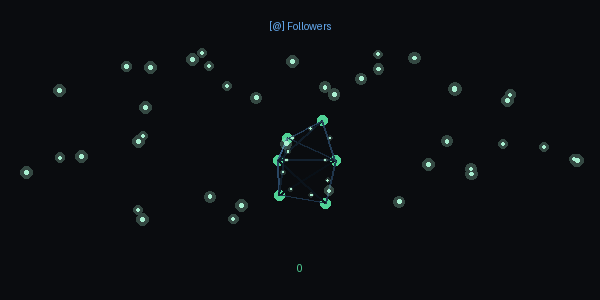

# 👋 Marcelo Burgos

**We are only particles dancing in the quantum foam of existence**

---

## 📊 GitHub Profile Metrics

*Animated metrics across all repositories - updated in real-time*

<table align="center" border="0" cellpadding="0" cellspacing="0" style="border: none; width: 100%; max-width: 100%;">
  <tr>
    <td align="center" style="border: none; padding: 12px;">
      
    </td>
    <td align="center" style="border: none; padding: 12px;">
      
    </td>
  </tr>
  <tr>
    <td align="center" style="border: none; padding: 12px;">
      
    </td>
    <td align="center" style="border: none; padding: 12px;">
      
    </td>
  </tr>
</table>

---

## 📈 GitHub Statistics

---

## 🛠️ Technology Stack

<table align="center" border="0" cellpadding="0" cellspacing="0" style="border: none;">
  <tr>
    <td align="center" style="border: none; padding: 14px;">
      
    </td>
    <td align="center" style="border: none; padding: 14px;">
      
    </td>
    <td align="center" style="border: none; padding: 14px;">
      
    </td>
    <td align="center" style="border: none; padding: 14px;">
      
    </td>
  </tr>
  <tr>
    <td align="center" style="border: none; padding: 14px;">
      
    </td>
    <td align="center" style="border: none; padding: 14px;">
      
    </td>
    <td align="center" style="border: none; padding: 14px;">
      
    </td>
    <td align="center" style="border: none; padding: 14px;">
      
    </td>
  </tr>
</table>

---

## 📫 Connect

---

*GitHub metrics are aggregated across all repositories. Last updated: February 2025*

